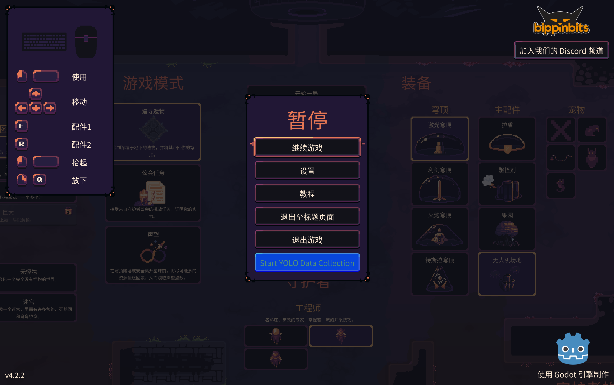

除夕快乐！这里是 [@LemonNekoGH](https://github.com/LemonNekoGH) 哦～春节前的最后一篇 DevLog 就由我来写吧！

## 回顾

去年的 [DevLog](../DevLog-2025.08.26/index.md) 中，我们分享了 `airi-factorio` 纯视觉方向的一些进展，今天我想和大家分享一下我们在 Dome Keeper 游戏方向的一些进展……

等下，柠猫？你怎么不继续写 `airi-factorio` 了呢？

其实是我打退堂鼓了，因为 Factorio 太自由了，太复杂了，我实在是驾驭不了，于是转向了 [Dome Keeper](https://store.steampowered.com/app/1637320/Dome_Keeper/)，一个相对简单的游戏。

那到目前为止我做了些什么呢？

1. 编写了一个 mod 用来采集数据。在安装 mod 之后，可以在暂停菜单里找到一个 `Start YOLO Data Collection` 按钮，点击后开始采集。

    

2. 简单采集了一点点数据。

    

好像不多？但是已经遇到了不少坑和细节问题了，所以要写写 DevLog 来记录一下。

### 细节

- 组织仓库结构。

    Dome Keeper 的 mod 的开发前提是反编译游戏，但是我们不能把源代码发布出去，所以需要想一下仓库结构。我把反编译之后的游戏放到了根目录的 external 文件夹，把整个文件夹都放进了 .gitignore 里，而 mod 代码则链接到游戏源码目录中去。

- 采样策略。

    目前我们的采样策略是，每 0.5s 帧采集一帧，但是很多时候画面中可能一个目标都没有，结果就是“负样本”特别多，数据量看着变大了，其实有效信息密度下降。

    我们后来把规则改成了：只有出现 `enemy` 或者 `ore_*` 才算“有目标帧”，并且 **必须先采够 5 张有目标的帧，才允许采 1 张无目标帧**。这样既保留一点背景，又不会把训练集稀释得太厉害。

- UI 叠加导致“错标”。

    采集过程中如果暂停菜单或者升级面板（TechTree）打开，画面会被 UI 覆盖，但我们的标签仍然在标矿物和敌人。这个问题非常隐蔽，因为从标注 txt 看不出来，只有到可视化时才会发现。

    后来我们用一个简单的办法：给 PauseMenu / TechTreePopup 加 group 标记，只要检测到这个 group 里有可见节点，就直接跳过采集。

- 坐标系不一致导致整体偏移。

    这是最头疼的一次坑：所有目标的 bbox 都整体偏移，但方向一致，看起来像“整体缩放错了”。

    原因是 **view 的逻辑尺寸** 和 **真实纹理像素尺寸** 不一致。我们之前用 `viewport.get_visible_rect().size` 来算 bbox，但截图用的是 texture 的像素尺寸，结果坐标空间错位。修复方式是：先把 bbox 从 view 坐标缩放到 image 像素坐标，再做 letterbox 的缩放和偏移。

- Letterbox 影响标签。

    我们把输出统一成 `640×640`，做了居中 padding（灰色 `114/255`），这步如果不对 bbox 做同样的变换，标注必然错位。

    所以后面变成了两步：先计算 bbox 的缩放 + offset，最后再归一化到 `640×640`。

- 数据集切分策略。

    之前想按 session 切分，但一局可能会很长，而且你也可能在同一个 session 里玩多局。于是改成按时间切分，按 **30 秒一个段**，并按 **4/1/1** 循环分配到 `train/val/test`。这样三分钟就能覆盖一轮，验证成本低得多。

- 性能与卡顿。

    `Image.resize()` 和 `save_png()` 都是 CPU/IO 密集操作，采样频率太高会有卡顿。我们尽量通过“减少无目标帧”来降低 IO 压力，而不是一开始就上线程。

### 小结

目前我们完成了一个**能稳定采集、能快速验证**的闭环：
采集 → 过滤无目标 → 自动切分 → 自动生成 `data.yaml` → 直接训练。

训练日志里也能看到效果：
矿物类（ore_*）mAP 较高，说明采集链路是对的；
dome / enemy / player 仍然偏少，需要后续补样本。

## 下一步

还记得 `airi-factorio` 仓库里的纯视觉方向的 Playground 吗？我打算扩展它，让它支持 Dome Keeper，让 `proj-airi` 整个组织都可以复用。还有，我们还需要更多的样本，尤其是 `dome`、`enemy` 和 `player` 类别的样本。

让我们期待接下来的进展吧！哦对了，mod 代码已经开源了，欢迎大家[来玩](https://github.com/proj-airi/game-playing-ai-dome-keeper)！

除夕快乐！
